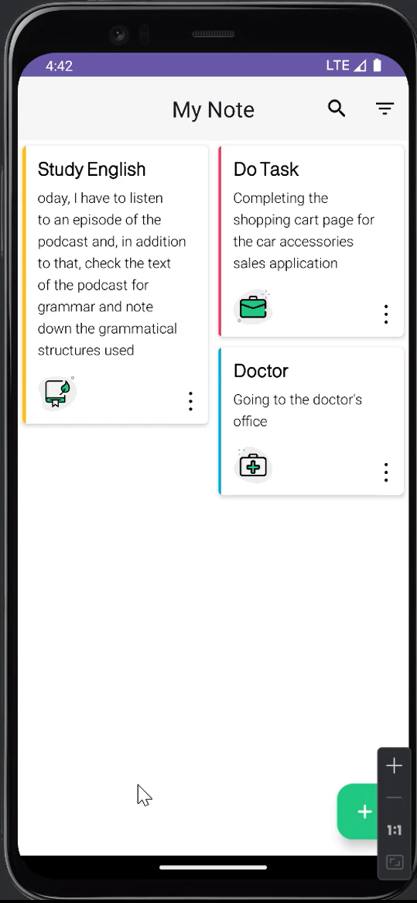
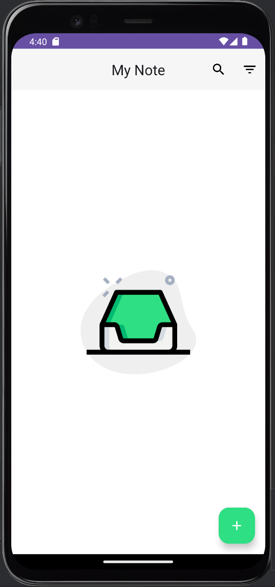

## TechStack

- [Kotlin](https://kotlinlang.org/)  
- [MVVM (Model-View-ViewModel)](https://developer.android.com/topic/architecture)  
- [XML](https://developer.android.com/guide/topics/resources/layout-resource)  
- [Hilt](https://dagger.dev/hilt/)  
- [Room](https://developer.android.com/training/data-storage/room)   
- [Kotlin Coroutines](https://kotlinlang.org/docs/coroutines-overview.html)  
- [Kotlin Flow](https://kotlinlang.org/docs/flow.html)  
- [LiveData](https://developer.android.com/topic/libraries/architecture/livedata)  
- [ViewBinding](https://developer.android.com/topic/libraries/view-binding)

## Screenshots

    

